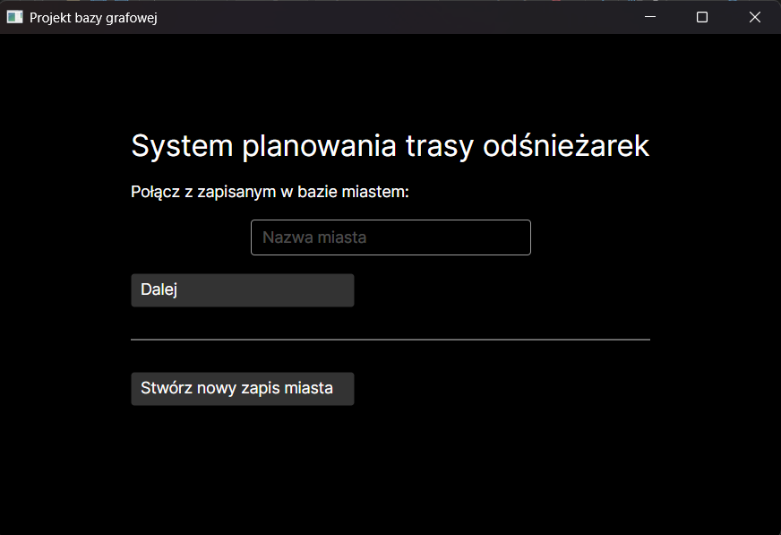
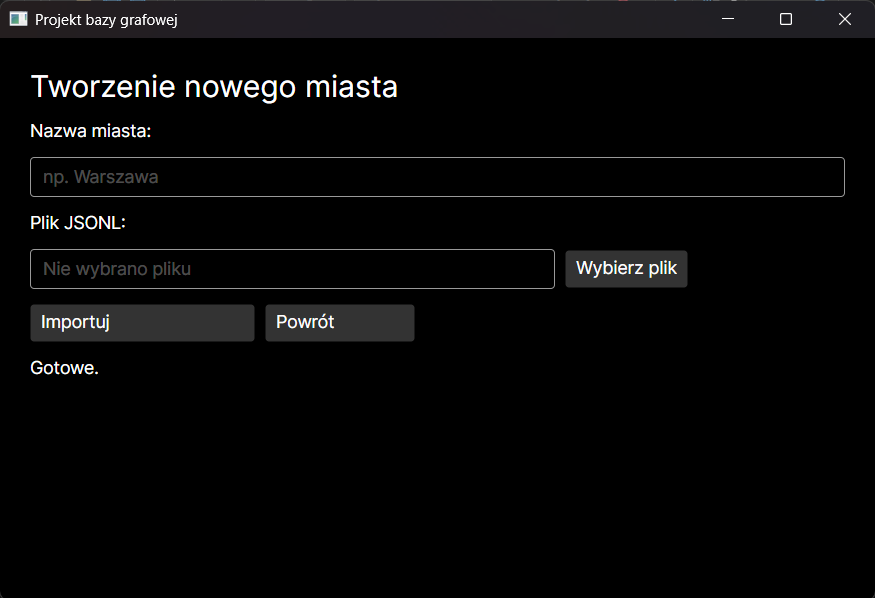
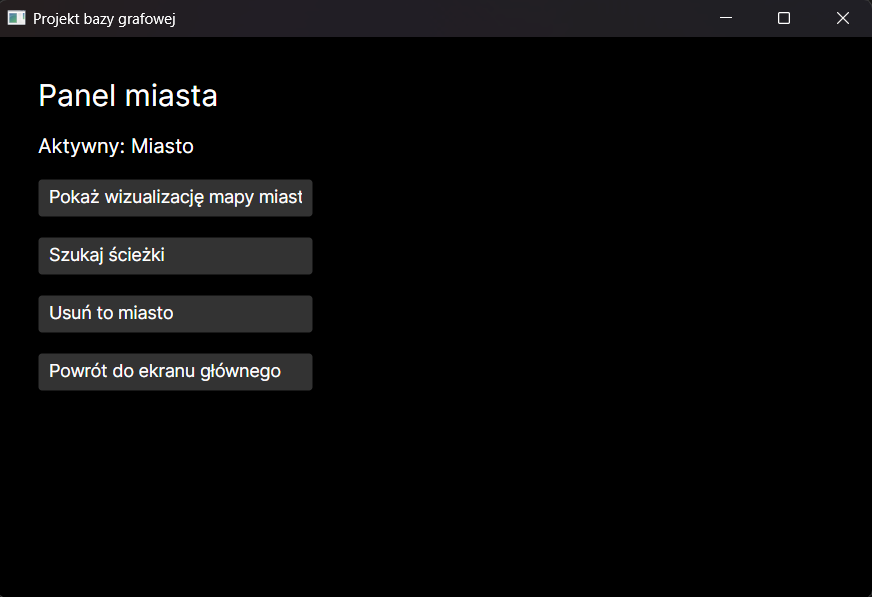
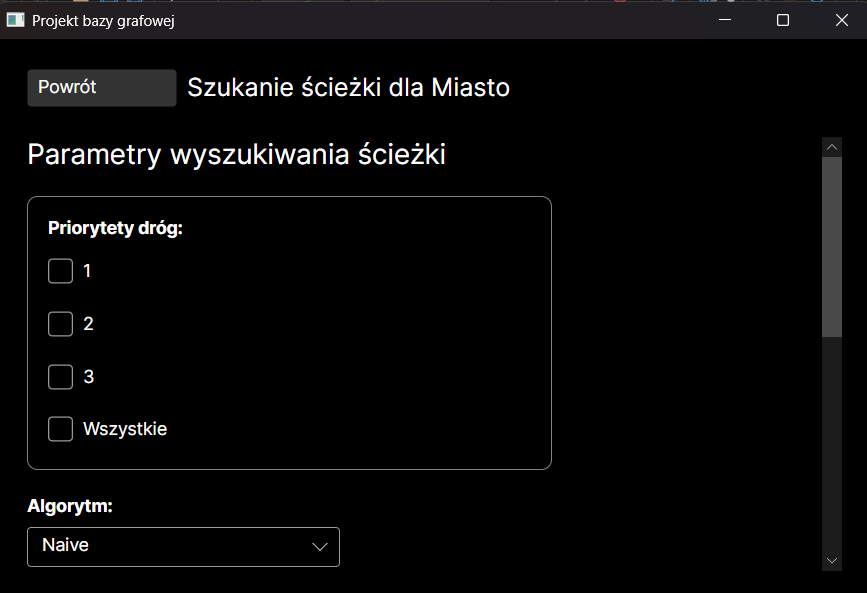
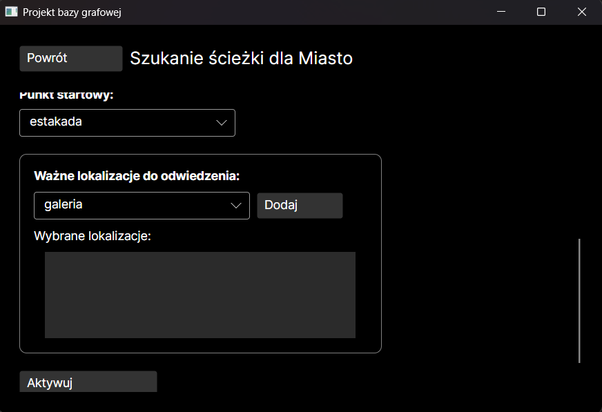
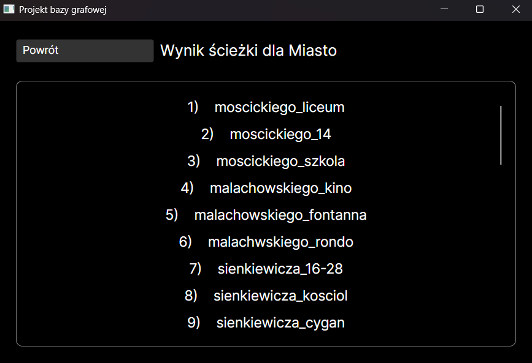

# Projekt aplikacji używającej grafowej bazy danych: System planowania trasy odśnieżarek
Piotr Nowak

## 1. Cel i zakres projektu
Celem projektu było stworzenie desktopowej aplikacji umożliwiającej planowanie tras odśnieżarki
przez misato, reprezentowane jako graf w bazie danych. System umożliwia dodawanie nowych miast, oraz ich
usuwanie, wizualizacje grafu reprezentującego miasto, jak i znajdywanie ścieżek w grafie używając pewnych
wejściowych parametrów.

## 2. Opis problemu
Planowanie tras odśnieżarki jest problemem, który można rozwiązać algorytmami z rodziny Chinese Postman
Problem. Konkretnie jest to podrodzina Rural Mixed Chinese Postman Problem - problem ten zakłada znalezienie
efektywnej ścieżki po grafie posiadającym zarówno skierowane jak i nieskierowane krawędzie, gdzie należy
odwiedzić jedynie część owych krawędzi. Problem ten jest NP-trudny.

Niestety z uwagi na brak istniejących implemetacji algorytmów tej rodziny w używanej w tym projekcie
grafowej bazie danych oraz na brak odpowiedniej ilości czasu potrzebnego na zapoznanie się ze sposobami
rozwiązania owego problemu, algorytm służący wytyczaniu dróg w tej aplikacji został skonstruowany jako
algorytm zachłanny i jest zedfiniowany w późniejszej części tego sprawozdania.

## 3. Wymagania systemowe
Projekt został stworzony w środowisku .NET 8 na platformę Windows 11 o architekturze x86_64. Wykorzystuje on:

 - C# jako język oprogramowania,
 - Neo4J jako bazę danych, wraz z addonem GDS
 - Avalonia jako framework UI

Całość została stworzona przy użyciu Visual Studio 2022.
Uruchomienie tego programu jest dodatkowo możliwe przy użyciu Docker-a w celu ustawienia potrzebnej bazy danych.

## 4. Projekt bazy danych
Ogólna struktura wykorzystanej bazy danych może być opisana jako grupa rozłączonych od siebie grafów rozróżnianych
przez parametr **graph_name**. Dokładny opis zarówno węzłów jak i relacji znajduje się poniżej:

  1. Węzeł:
   - `Etykiety`: IMPORTANT_PLACE - oznacza ono miejsce ważne w mieście, np. szpital
				 JUNCTION - oznacza skrzyżowanie
				 START - oznacza miejsce startowe odśnieżarki
				 UTURN - oznacza "nawrócenie odśnieżarki", to takich węzłów prowadzi najczęściej tylko 1 droga
   - `Parametry`:
		- Wspólne:
			- <id> - wewnętrzny identyfikator węzła
			- graph_name - nazwa "podgrafu", której węzeł jest częścią
			- name - nazwa węzła. Jest ona unikalna dla całej bazy
		- Tylko dla __IMPORTANT_PLACE__:
			- visited - wartość true/false odpowiadająca na to czy węzeł został już odwiedzony
			
  2. Relacja:
   - `Etykiety`: ONE_WAY - oznacza drogę jednokierunkową, której kierunek jest identyczny jak kierunek samej relacji
				 TWO_WAY - oznacza drogę dwukierunkową
   - `Parametry`:
		- Wspólne:
			- <id> - wewnętrzny identyfikator relacji
			- graph_name - nazwa "podgrafu", którego relacja jest częścią
			- name - nazwa relacji. Jest ona unikalna dla całej bazy
			- length - długość drogi wyrażona w metrach
			- addon - może przyjmować wartości 1 lub 0.8. Słuzy do identyfikowania trasy dojazdu do węzłów IMPORTANT_PLACE
					  jak i do obliczania pełnej wagi trasy w programie
			- priority - może przyjmować wartości 1, 2 lub 3 (1 oznacza najwyższy priorytet). Używana przy wyborze tras oraz
						 obliczaniu wagi
			- speed - maksymalna dozwolona prędkość na drodze. Używana w obliczaniu wagi
			- visited - wartości int >= 0. Definiują ile razy dana krawędź została odwiedzona.
			- weight - waga używana zarówno w algorytmie Dijkstra wewnątrz bazy, jak i waga cząstkowa podczas obliczania
					   pełnej wagi w programie. Definiowana jest wzorem: `3.6*length/speed * (1+0.25*priority)`

## 5. Algorytm znajdywania ścieżek
Używany w projekcie algorytm znajdywania ścieżek może zostać zaklasyfikowany jako algorytm zachłanny. Przyjmuje on
jako swoje parametry: **listę priorytetów analizowanych dróg**, **startową pozycję**, **listę odwiedzanych ważnych miejsc**.
Jego działanie jest następujące:

 1) Uywając implementacji algorytmu Dijkstry znajdowana jest najkrótsza możliwa droga pomiędzy pozycją
	startową oraz kolejnymi miejscami koniecznymi do odwiedzenia (w kolejności sprecyzowanej w samym parametrze).
	Wszystkie węzły będące częścią tej trasy otrzymują wartość parametru **addon** = 0.6.

 2) Rozpoczynamy analizę od węzła startowego.
 
 3) Wybór krawędzi o najniższej wadze z krawędzi dostępnych dla obecnie odwiedzanego węzła. 'Dostępne'
	oznacza krawędź o priorytecie sprecyzowanym w liście parametrów lub posiadającego wartość parametru addon = 0.8
	która nie została jeszcze odwiedzona.
 
 4) Jeżeli nie znaleziono żadnej dostępnej krawędzi program używa implementacji algorytmu Dijkstry w celu
	znalezienia najbliższej nieodwiedzonej krawędzi w grafie spełniającej warunki dostępności.
	
 5) Jeżeli algorytm Dijkstry znajdzie daną trasę, trasa ta jest dodawana do wyniku algorytmu, oraz wszystkie krawędzie 
	będące częścią tej trasy i posiadające odpowiednie priorytety zwiększają swoją wartość parametru **visited**.
	Dodatkowo obecnie analizowanym węzłem staje się węzeł połączony z ową znalezioną krawędzią.
	
 6) Jeżeli algorytm Dijkstry nie znajdzie żadnej trasy, algorytm się kończy i zwraca skończoną listę odwiedzonych krawędzi.

 7) Jeżeli znajdzie się odpowiednią krawędź w analizowanym węźle, jest ona dodawana do listy zwracanych krawędzi, a obecnie
	analizowanym węzeł staje się ten bezpośrednio połączony z ową krawędzią. 

 8) Powrót do punktu 3
 
Bardziej czytelny opis tego algorytmu znajduje się na grafice poniżej:
[grafika]

# 6. Opis interfejsu użytkownika
Poniżej znajduje się czytelny opis każdego z ekranów aplikacji:

 1) Ekran startowy

 	

	Dostępne są 2 opcje:

		1) wpisanie nazwy miasta zapisanego w bazie danych i kliknięcie połącz - przekierowywuje to na panel zarządzania
		2) dodanie miasta klikając w przycisk "Stwórz nowy zapis miasta" - przekierowywuje na ekran tworzenia nowego zapisu do bazy danych

 2) Ekran tworzenia

	

	Aby stworzyć nowy zapis do bazy danych należy wyełnić pole "Nazwa miasta" unikalną nazwą. W przypadku powtórek proces nie dojdzie do skutuku, a na dole ekranu pojawi się infrormacja o niepoprawnej nazwie. Stworzenie nowego zapisu jest możliwe jedynie za pomocą specjalnego pliku .jsonl, którego składnia zostanie rozpisana w późniejszej części dokumantacji (projekt ma 2 testowe pliki spełniające warunki programu). Po poprawnym stworzeniu nowego zapisu zosaje się przekierowanym na ekran zarządzania.

 3) Ekran zarządzania

 	

	Ekran ten posiada 3 główne funkcjonalności:

		1) Usunięcie zapisu - usuwa zapis miasta z bazy danych i automatycznie przenosi na ekran startowy po zakończeniu procesu.
		2) Wizualizacja grafu miasta - przenosi na ekran wizualizacji, gdzie można zobaczyć podgląd zapisu grafu w bazie. Posiada on limiter widocznych relacji.
		3) Szukanie optymalnej ścieżki - przenosi na ekran szukania ścieżek

 4) Ekran wizualizacji

	

	Wizualizacja ładuje się domyślnie podczas otwarcia ekranu z limitem 25. Można ten limit zmienić i po kliknięciu przycisku "Odśwież" widok załaduje się na nowo. Przy próbie wpisania wartości niebędącej liczbą większą lub równą od 0 otrzyma się: dla wartości negatywnych lub ułamków - błąd wyświetlenia, a dla wartości tekstowych - wyświetlona zostanie wizualizacja dla 25.

 5) Ekran szukania ścieżek

	

	

	Ekran ten pozwala na wybór parametrów działania przeszukiwania ścieżek:

		1) Priorytety - można zaznaczyć 1 lub więcej opcji (nie są to wartości dynamiczne - każda krawędź w graie może mieć priorytet jedynie 1/2/3)
		2) Algorytm - dostępny oecnie jedynie 1: Naiwny opisany wcześniej
		3) Wybór punktu startowego - dynamicznie wyciągany z analizowanego grafu (można wybrać jedynie 1)
		4) Ważne miejsca do odwiedzenia - również dynamicznie wyciągane z analizowanego grafu, możne wybrać ich od 0 do wszystkich. UWAGA: kolejność wyboru ma znaczenie!
	Aby program zadziałał trzeba wybrać minimum 1 priorytet oraz punkt startowy. Po aktywacji algorytmu pojawi się informacja o pracy programu. Gdzy praca się zakończy zostanie sięprzekierowanym na ekran wyników.

 6) Ekran wyników

 	

	Ekran ten jest listą nazw dróg zapisanych w grafie w kolejności, której należy je odwiedzić. Lista ta jest przewijalna oraz po kliknięciu przycisku "Powrót" zostanie się przekierowanym do ekranu szukania ścieżek.

# 7. Wymogi odnośnie plików .jsonl
Aby plik mógł być przetworzony przez program musi składać się jedynie z takich elementów:
 - element węzła: `{"type": "node", "label": [lista etykiet], "name": nazwa}`

	Etykiety mogą mieć wartości: __JUNCTION, IMPORTANT_PLACE, START, UTURN__. Może ich być więcej niż 1.
 - element relacji: `{"type": "edge", "label": etykieta, "name": nazwa, "length": liczba, "maxspeed": liczba, "priority": 1/2/3, "from": nazwa węzła, "to": nazwa węzła}`

	Etykiety mogą być jedynie __ONE_WAY lub TWO_WAY__ i są wzajemnie wykluczające się. Kolejność 'from' i 'to' jest istotna jedynie dla etykiety ONE_WAY.

Zalecane jest również aby najpierw w pliku znajdowały się same węzły a następnie relacje. Nie zastosowanie się do tego może spowodować błąd przy imporcie.

# 8. Insturkcja uruchomienia programu
Poczekajmy na Docker

# 9. Źródła
 - [Mixed Postman, Wikipedia](https://en.wikipedia.org/wiki/Mixed_Chinese_postman_problem)
 - ChatGPT
 - [Dokumentacja Neo4J GDS](https://neo4j.com/docs/graph-data-science/current/)
